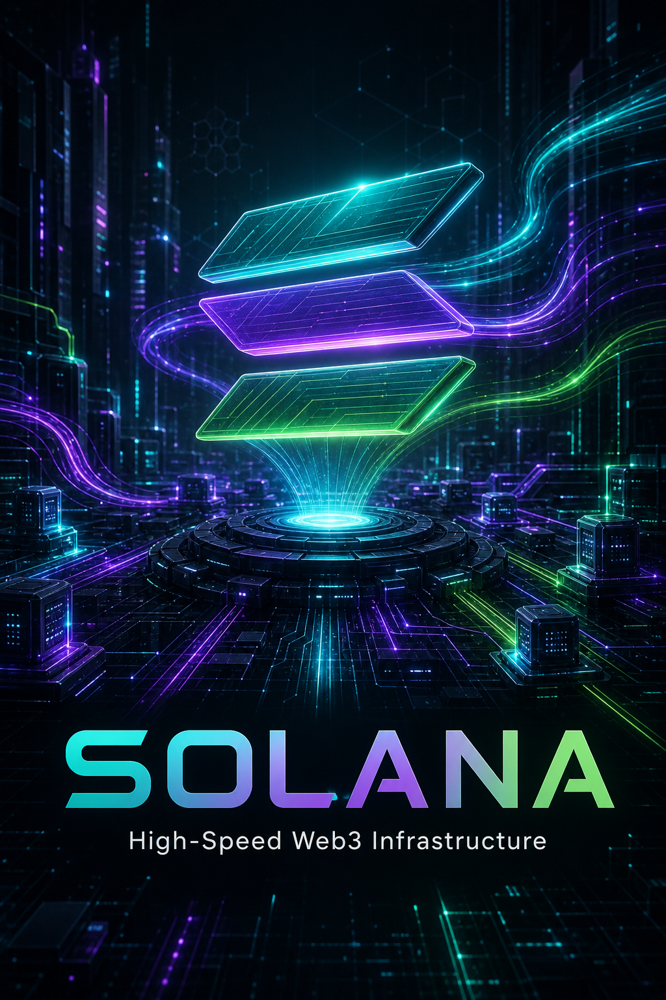
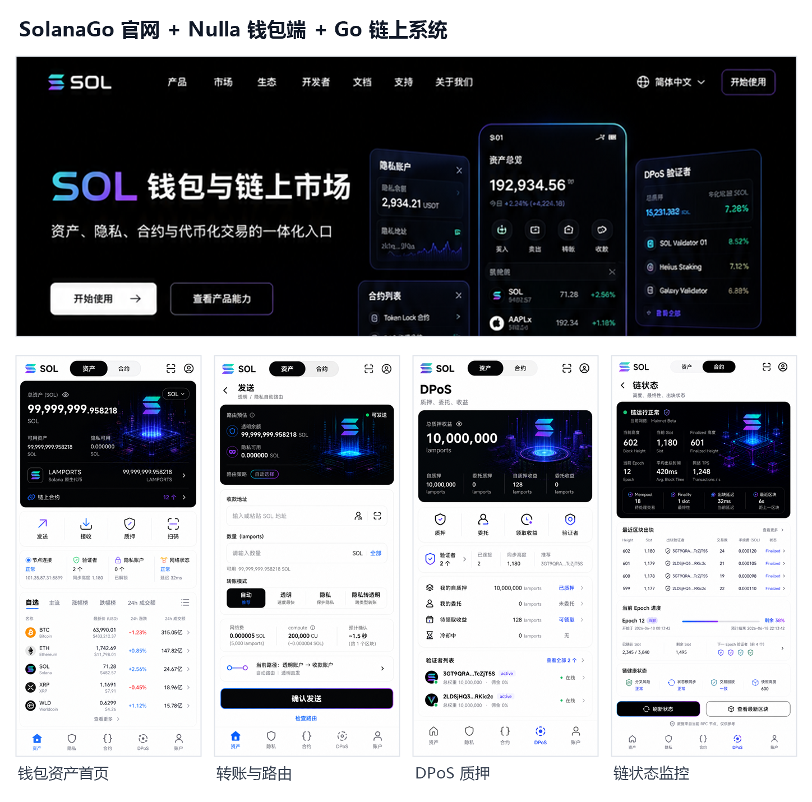
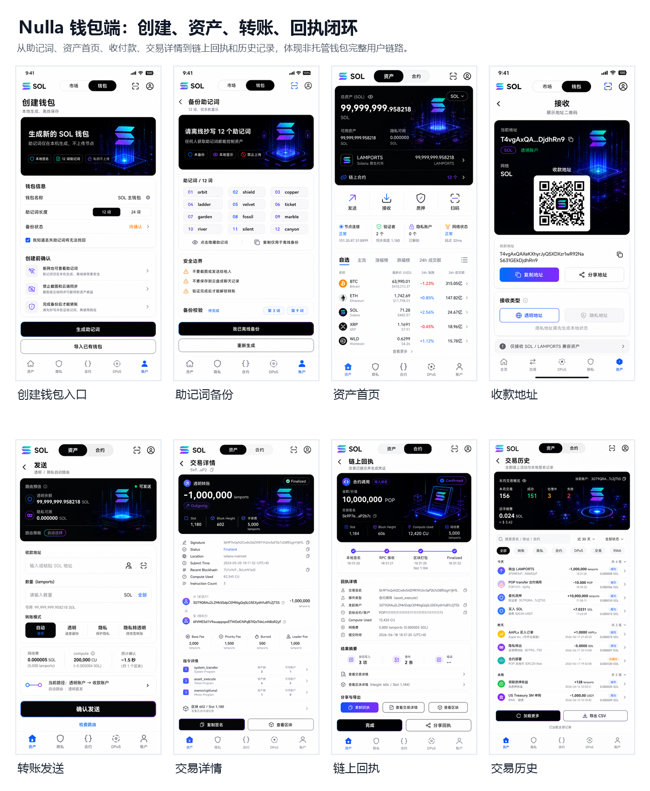
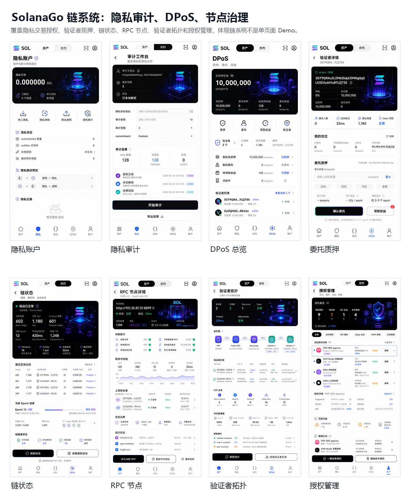
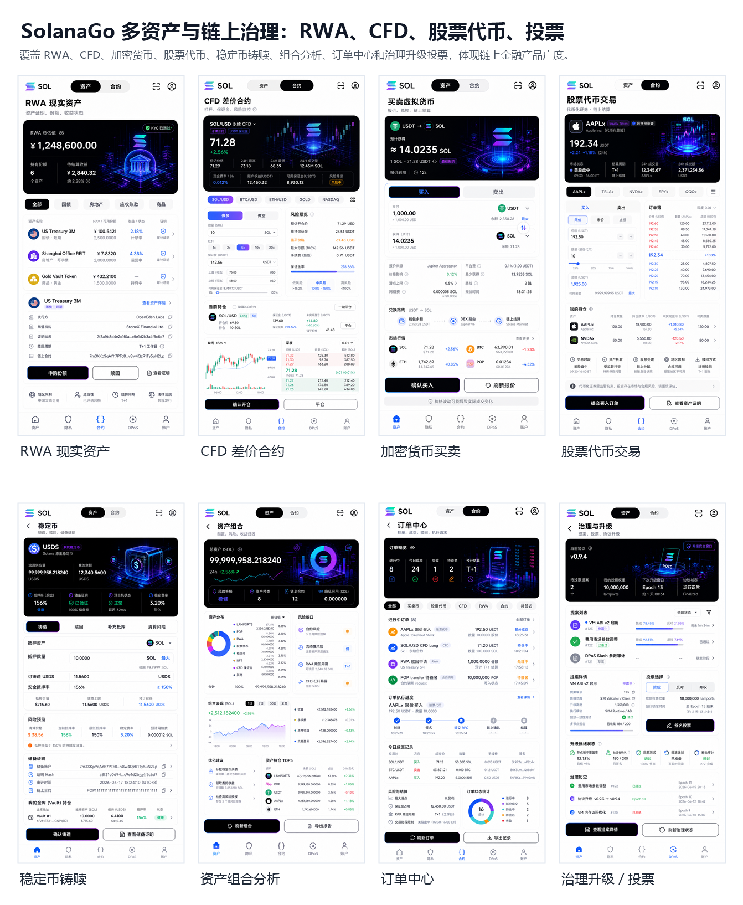
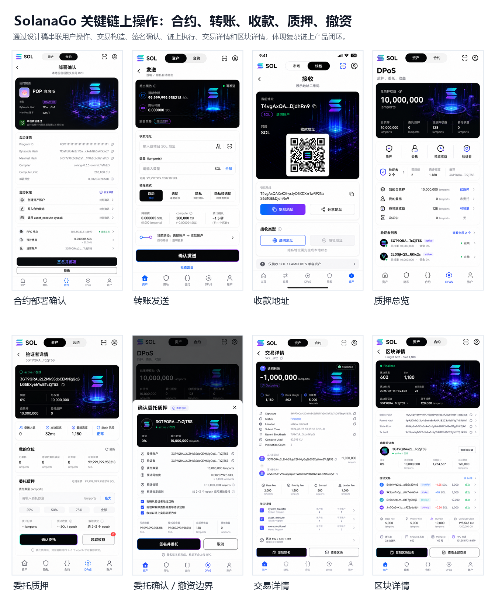

# Solana Golang

<p align="center">
  <strong>🚀 基于 Go 语言自研的高性能区块链基础设施</strong>
  <br>
  <sub>Production-Ready · 从零构建 · 金融级安全</sub>
</p>

<p align="center">
  <a href="#-项目简介">简介</a> ·
  <a href="#-开发者突破">突破</a> ·
  <a href="#-产品化展示">展示</a> ·
  <a href="#-项目定位">定位</a> ·
  <a href="#-架构设计">架构</a> ·
  <a href="#-快速开始">快速开始</a> ·
  <a href="#-核心特性">特性</a> ·
  <a href="#-项目结构">结构</a> ·
  <a href="#-路线图">路线图</a> ·
  <a href="#-许可证">许可证</a>
</p>

---

<p align="center">
  
</p>

---

## 📖 项目简介

**Solana Golang** 是一个从零开始、完全用 Go 语言实现的自研公链，目标是成为一条**真正可承载金融级业务的生产级链**。项目深受 Solana 架构思想的启发——包括 **Borsh 序列化**、**账户模型**、**交易结构**和 **Slot 时钟**——但在工程实现上做出了独立的架构决策，旨在构建一套**安全、高性能、可审计、可长期演进**的区块链基础设施。

> ⚠️ 本项目灵感来源是 Solana，但并非复制 Solana（翻译 Rust 代码），而是从零开始用 Go 语言独立构建的自研公链。Solana 官方实现使用 Rust 语言，位于 [solana-labs/solana](https://github.com/solana-labs/solana)。

## 🚀 开发者突破

这不是一个概念型 Demo，而是一套按生产链路拆解、可测试、可审计、可持续演进的 Go 区块链工程。

| 突破方向 | 开发者价值 |
|----------|------------|
| **自研 P2P 协议栈** | TCP/QUIC 双传输、P2P Frame、KAD DHT、安全会话和 Peer 保护都在代码内可读、可测、可替换 |
| **Borsh + Schema Registry** | P2P 与链上数据坚持二进制协议，raw bytes 必须带类型、版本、编码和哈希，降低协议演进风险 |
| **金融级状态存储** | Pebble/LevelDB 双引擎、事务写入、Migration、前缀查询和表级缓存，为账户状态和区块索引提供稳定底座 |
| **Slot + QC 共识基线** | 从 SlotClock、Vote 到 Quorum Certificate 逐步闭环，方便开发者理解并参与共识模块演进 |
| **Solana 兼容密码学工具链** | Ed25519、X25519、AES-GCM、BIP-39、SLIP-0010、PDA 与多编码工具集中在 `utils` 中，便于钱包和 DApp 集成 |
| **ZK 与合规金融路线** | 隐私交易、ZK Compression、RWA、证券代币和衍生品交易被纳入长期架构，不止于基础链节点 |

## 🖼️ 产品化展示

| Nulla 公链总览 | 钱包与交易流 |
|----------------|--------------|
|  |  |

| 链治理 | 资产治理 |
|--------|----------|
|  |  |

| 节点运维与监控 |
|----------------|
|  |

## 🎯 项目定位

| 维度 | 目标 |
|------|------|
| **可靠性** | 每个模块均经过严格的单元测试、边界测试、竞态测试与模糊测试，无例外 |
| **安全性** | 多层安全防护——加密会话、Schema 校验、签名验证、原子写入 |
| **性能** | 高吞吐 P2P 网络 + 高性能 LSM 存储引擎，面向大规模交易场景 |
| **可维护性** | 清晰的模块边界、结构化日志、内置指标、渐进式路线图 |
| **去中心化** | 自研 P2P 网络，不依赖任何中心化组件或第三方框架

### 设计哲学

- **生产即目标** —— 以金融级业务为最终交付标准，每个阶段都有明确的完成定义和质量门槛
- **测试驱动品质** —— 每个模块均覆盖单元测试、边界测试、竞态检测（`-race`）和模糊测试（fuzz），测试与功能代码同步交付
- **无外部框架依赖** —— 不使用 libp2p、不使用 protobuf，P2P 网络层完全自研，对每一层协议具备完全控制力
- **安全至上** —— 内置 Schema Registry，所有 raw bytes 强制携带类型/版本/编码/哈希元信息；签名必须包含 domain_separator + message_type + version；私钥绝不写入日志、RPC 或 P2P 消息
- **严格的序列化规范** —— Borsh 用于所有二进制协议，JSON 仅用于外部 RPC 接口，内外编码严格分离
- **工程可观测性** —— 结构化日志、内置指标、连接保护、速率限制，生产环境全链路可追踪
- **渐进式演进** —— 六阶段路线图，从协议基线到 ZK 零知识证明，每一步都有明确的交付物和质量标准

---

## 🏗️ 架构设计

```
┌──────────────────────────────────────────────────────────────┐
│                         RPC Layer                            │
│              JSON-RPC 2.0 · HTTP · 批量请求                   │
├──────────────────────────────────────────────────────────────┤
│                      Consensus Layer                         │
│         SlotClock · Vote · QuorumCertificate · QC            │
├──────────────────────────────────────────────────────────────┤
│                        P2P Network                           │
│   TCP/QUIC Transport · KAD DHT · Secure Session · 26 协议    │
├──────────────────────────────────────────────────────────────┤
│                      Business Models                         │
│     Account · Transaction · Block · Instruction · Merkle     │
├──────────────────────────────────────────────────────────────┤
│                       Storage Layer                          │
│    Pebble/LevelDB · Migration · Cache · Snapshot · WAL       │
├──────────────────────────────────────────────────────────────┤
│                    Serialization Layer                       │
│        Borsh Codec · Schema Registry · Envelope              │
└──────────────────────────────────────────────────────────────┘
```

### 模块依赖方向

```
cmd (入口装配)
 ├── config     ← YAML 配置加载与校验
 ├── database   ← Pebble/LevelDB 存储引擎
 ├── schema     ← Schema 注册中心
 ├── p2p        ← 自研 P2P 网络 (TCP + QUIC)
 ├── consensus  ← Slot 时钟 · 投票 · QC
 ├── rpc        ← JSON-RPC HTTP 服务
 ├── structure  ← 业务事实模型
 ├── codec      ← Borsh 编解码
 └── utils      ← 通用工具 (密码学·编码·钱包)
```

---

## ⚡ 快速开始

### 环境要求

- **Go** >= 1.24.6
- 支持的操作系统：Linux / macOS / Windows

### 构建

```bash
# 克隆仓库
git clone https://github.com/your-org/solana_golang.git
cd solana_golang

# 构建二进制
go build ./cmd

# 运行测试
go test ./...

# 竞态检测
go test -race ./...
```

### 启动节点

```bash
# 使用默认配置启动
go run ./cmd

# 指定配置文件
go run ./cmd -config config/local/config.yaml

# 通过环境变量指定配置
APP_CONFIG=config/demo/config.yaml go run ./cmd
```

### 默认配置概览

| 配置项 | 默认值 | 说明 |
|--------|--------|------|
| RPC 地址 | `:8899` | JSON-RPC HTTP 监听地址 |
| P2P 协议 | `quic` | 优先使用 QUIC，也支持 TCP |
| P2P 监听 | `0.0.0.0:5002` | P2P 网络监听地址 |
| 数据库引擎 | `pebble` | 高性能 LSM-based 存储 |
| 数据库路径 | `./data/p2p-test/local` | 数据持久化目录 |
| 最大 Peer 数 | `64` | P2P 连接上限 |
| 日志格式 | `json` | 结构化 JSON 日志 |

详细配置请参考 `config/` 目录下的多环境配置文件。

---

## 🔥 核心特性

### 🔗 自研 P2P 网络层

完全从零构建的去中心化对等网络，不依赖任何第三方 P2P 框架：

- **双传输协议**：TCP 与 QUIC 并行支持，运行时可切换
- **P2P Frame 协议**：Magic Number (`0x53475032`) + 版本 + 类型 + 长度 + SHA256 校验和
- **26 种内置协议**：控制面（Ping/Pong、握手、身份识别、节点发现）· 数据面（区块、交易）· 共识面（HotStuff 投票）
- **KAD DHT 路由**：256 Bucket Kademlia 分布式哈希表，高效节点发现
- **安全会话**：Ed25519 节点认证 + AES-256-GCM 加密通信
- **连接保护**：入站限制、IP 连接数限制、消息速率限制、Peer 评分
- **心跳探活**：周期性 Ping/Pong，自动剔除失联节点

### ⛓️ 共识层

基于 Slot 时钟的 HotStuff 风格共识：

- **SlotClock**：本地单调时钟 + 固定 Slot 时间（400ms/Slot）
- **投票机制**：Confirm Vote（含区块哈希）+ Skip Vote（空区块）
- **Quorum Certificate**：2/3 质押阈值 + 投票聚合器
- **冲突检测**：自动拒绝重复/冲突投票

### 💾 高性能存储

以 CockroachDB Pebble 为主引擎的企业级存储方案：

- **双引擎支持**：Pebble（高性能 LSM）+ LevelDB（兼容备选）
- **16 张核心表**：Account、Block、Transaction、UTXO、Peer 等
- **读事务快照**：MVCC 风格的一致读视图
- **原子批量写**：DataTransaction 保证多表更新的原子性
- **前缀/范围查询**：支持正序和逆序遍历
- **表级缓存**：TTL + 容量限制
- **Migration 框架**：版本化的数据库 Schema 升级

### 📦 Borsh 序列化与 Schema Registry

严格的序列化规范和类型安全：

- **Borsh Codec**：高效二进制编解码，支持零拷贝读取器
- **Schema Registry**：所有 raw bytes 强制携带类型/版本/编码/SchemaID/负载哈希
- **Envelope**：Magic Number (`0x53475352`) + 完整元信息
- **Canonical Hash**：签名哈希 = SHA256(domain_separator ‖ message_type ‖ version ‖ canonical_payload)
- **内外编码分离**：P2P 用 Borsh，外部 RPC 用 JSON DTO

### 🔐 密码学工具集

完整的 Solana 兼容密码学实现：

- **Ed25519** 签名/验签
- **X25519** 密钥交换
- **AES-256-GCM** 对称加密
- **HKDF** 密钥派生
- **BIP-39** 助记词生成
- **SLIP-0010** HD 钱包
- **Solana 派生路径** `m/44'/501'/...'`
- **PDA** (Program Derived Address)
- **Base58 / Base64 / Hex** 编码

---

## 📂 项目结构

```
solana_golang/
├── cmd/                        # 入口程序
│   ├── main.go                 #   主节点启动入口
│   ├── node_identity.go        #   节点身份管理 (Ed25519 密钥)
│   └── p2pstress/              #   P2P 压力测试工具
│
├── config/                     # 配置管理
│   ├── config.go               #   配置结构定义与校验
│   ├── loader.go               #   YAML 配置加载器
│   ├── local/config.yaml       #   本地开发环境配置
│   ├── demo/config.yaml        #   演示环境配置
│   ├── stage/config.yaml       #   预发布环境配置
│   └── prod/config.yaml        #   生产环境配置
│
├── p2p/                        # 自研 P2P 网络层 (61 文件)
│   ├── host.go                 #   P2P Host 主控
│   ├── message.go              #   P2P 消息帧 + Borsh 编解码
│   ├── protocol.go             #   协议定义 (26 种协议)
│   ├── protocol_registry.go    #   协议注册与分发
│   ├── tcp_transport.go        #   TCP 传输层
│   ├── quic_transport.go       #   QUIC 传输层
│   ├── secure_session.go       #   安全会话 (Ed25519 + AES-GCM)
│   ├── kad_routing_table.go    #   KAD 路由表 (256 Bucket)
│   ├── kad_protocol.go         #   KAD 协议处理
│   ├── peer_store.go           #   Peer 信息管理
│   ├── bootstrap.go            #   引导节点连接
│   ├── host_connections.go     #   连接池管理
│   ├── host_heartbeat.go       #   心跳探活
│   ├── peer_protection.go      #   Peer 保护 (限流·评分)
│   ├── metrics.go              #   P2P 指标
│   └── peerstore/              #   Peer 持久化存储
│
├── consensus/                  # 共识层
│   ├── slot.go                 #   SlotClock · Vote · QC
│   ├── errors.go               #   共识错误定义
│   └── doc.md                  #   共识设计文档
│
├── database/                   # 存储层
│   ├── interface.go            #   Database 接口定义 (16 表)
│   ├── service.go              #   完整数据库实现 (CRUD·事务·分页)
│   ├── factory.go              #   存储引擎工厂 (Pebble/LevelDB)
│   ├── migration.go            #   Schema Migration 框架
│   ├── key_codec.go            #   表前缀编码
│   ├── cache.go                #   表级缓存
│   ├── pebble/engine.go        #   Pebble 引擎适配
│   └── leveldb/engine.go       #   LevelDB 引擎适配
│
├── structure/                  # 业务事实模型 (27 文件)
│   ├── account.go              #   账户模型
│   ├── transaction.go          #   交易结构
│   ├── block.go                #   区块结构 + Merkle 树
│   ├── instruction.go          #   指令模型
│   ├── keypair.go              #   密钥对
│   ├── simulator.go            #   交易模拟执行器
│   └── sysvar.go               #   系统变量
│
├── rpc/                        # JSON-RPC 服务
│   ├── server.go               #   HTTP JSON-RPC 2.0 服务
│   ├── handler.go              #   内置 RPC 处理器
│   └── types.go                #   RPC 数据类型
│
├── codec/borsh/                # Borsh 编解码
│   ├── writer.go               #   小端写入器
│   └── reader.go               #   小端读取器 + 零拷贝
│
├── schema/                     # Schema Registry
│   ├── registry.go             #   Schema 注册与查找
│   └── envelope.go             #   Envelope (元信息 + payload)
│
├── utils/                      # 通用工具包 (23 文件)
│   ├── crypto/                 #   密码学 (Ed25519·AES·HKDF)
│   ├── encoding/               #   编码 (Base58·Hex·Base64)
│   ├── wallet/                 #   钱包 (BIP-39·SLIP-0010·PDA)
│   └── p2p/                    #   P2P 工具 (MultiAddress)
│
├── doc/                        # 设计文档
├── go.mod                      # Go 模块定义
└── LICENSE                     # Apache License 2.0
```

---

## 🗺️ 路线图

### ✅ 阶段一：协议与存储基线
- [x] Borsh 序列化规范
- [x] Schema Registry
- [x] P2P Frame + Message 协议
- [x] 节点身份管理 (Ed25519)
- [x] 数据库 Migration 框架
- [x] 区块结构与 Merkle 树
- [x] 交易模拟执行器

### 🔄 阶段二：共识最小闭环
- [ ] Validator Set 管理
- [ ] Leader Schedule 调度
- [ ] Proposal 结构
- [ ] 签名 Vote + QC 生成
- [ ] P2P 共识消息处理器

### 📋 阶段三：链状态闭环
- [ ] 交易池 (Mempool)
- [ ] 账户模型完整实现
- [ ] 区块执行引擎
- [ ] State Root 计算
- [ ] Block Commit 流程

### 📋 阶段四：网络同步
- [ ] Peer Discovery 增强
- [ ] Block Headers 同步
- [ ] Block Body 同步
- [ ] Checkpoint Sync

### 📋 阶段五：生产强化
- [ ] 签名聚合 (BLS)
- [ ] 惩罚证据 (Slashing)
- [ ] 防 Sybil 攻击
- [ ] 全局限流
- [ ] Prometheus Metrics
- [ ] 压力测试与性能调优

### 📋 阶段六：ZK 零知识证明

将"高速透明链"升级为"高速+隐私+可扩容"的全能链，以 L1 原语形式原生集成 ZK 能力，而非外挂 L2。

#### 账户模型：单账户双余额 + 隐身地址

一个用户 = 一个 T-Addr（唯一身份）= 一个链上 Account = Lamports（透明余额）+ PrivacyBalance（隐私余额）。透明↔隐私一键互转，在同一账户内完成，原子性天然保证。

#### 地址体系：三层地址

| 地址 | 用途 | 链上可见 |
|------|------|----------|
| **T-Addr**（透明主地址） | 唯一身份，DApp/交易所兼容，公开收款 | 地址+余额+交易全可见 |
| **S-Meta**（隐身元地址） | 隐私收款标识，可公开发布（Twitter/ENS/支付页） | 永远不直接出现在链上 |
| **P**（一次性隐身地址） | 每笔隐私交易生成，P 之间不可链接，无法关联到 T-Addr | 隐私交易接收方字段 |

#### 密钥体系：一套密钥，统一派生

| 密钥 | 用途 |
|------|------|
| **SpendKey** | 签名授权隐私交易（最高安全，永不暴露） |
| **ScanKey** | 扫描链上 P，发现发给自己的隐私交易 |
| **ViewKey** | 解密金额（可授权会计/审计师，只读无资金风险） |
| **AuditKey** | 监管审计（需司法流程 + 多签授权） |

#### 交易模式：四种全覆盖

| 模式 | 操作余额 | 发送方可见 | 接收方可见 | 金额 | CU |
|------|----------|-----------|-----------|------|-----|
| T→T | Lamports | T-Addr | T-Addr | 明文 | ~5,000 |
| T→Z | L→Privacy | T-Addr | P（隐藏） | 部分隐藏 | ~150,000 |
| Z→T | Privacy→L | P（隐藏） | T-Addr | 明文 | ~150,000 |
| Z→Z | Privacy | P（隐藏） | P（隐藏） | 全隐藏 | ~300,000 |

#### ZK 全景

| 方向 | 目标 |
|------|------|
| **隐私交易** | ZK + ElGamal 同态加密 + Pedersen 承诺 + Groth16 证明，地址/金额双隐藏 |
| **ZK Compression** | 链下压缩状态，链上验证证明，存储成本降低 99%，租金降低 1000 倍 |
| **抗 MEV** | 订单加密，内存池不可见，从源头消除抢跑与三明治攻击 |
| **可验证链下计算** | ZK VM 链下执行，链上验证 proof，突破单链算力上限 |
| **隐私 DeFi** | 隐私 DEX、隐私借贷、隐私批量支付，可审计可合规 |
| **轻客户端** | 区块状态证明，无需全量同步即可验证链上数据 |

#### 可审计隐私（三层权限模型）

可审计隐私 = 平时隐私保密，需核查时依法、按权限追溯，不是彻底黑盒。

**第一层：正常使用时 = 纯隐私**

外人查链、区块浏览器：看不到转账金额、真实收发地址；不知道谁转的、转给谁、转了多少。
防偷窥、防 MEV 抢跑、防对手扒商业数据。隐私完全生效。

**第二层：你自己查（ViewKey）**

你持有 ViewKey，哪怕交易是隐私模式，也能解密、看自己所有隐私转账、余额、流水。
别人看不见，你全权掌控。

**第三层：按权限追溯（分级可审计）**

| 场景 | 权限范围 | 密钥 | 控制方式 |
|------|---------|------|----------|
| **主动授权（商务/合作）** | 只看你授权的几笔/某段时间的交易，看不到其他隐私数据 | ViewKey（时间/范围限定） | 用完可收回 |
| **监管/司法核查** | 按法规流程 + 必要授权，定向追溯交易、查清资金流向 | AuditKey（多签 + 阈值解密） | 有依据、有限范围，非全网乱查 |

#### 设计总结

```
一个用户身份（唯一）
一套密钥：SpendKey + ScanKey + ViewKey + AuditKey
一个链上 Account = 透明余额 + 隐私余额
两个对外标识：T-Addr（公开）+ S-Meta（隐私收款）
四种交易模式：T→T / T→Z / Z→T / Z→Z
三层审计权限：纯隐私 → 自己查 → 按权限追溯

地址可隐身 · 金额可隐藏 · 身份统一 · 可审计 · 可 DeFi
```

### 📋 阶段七：RWA 现实资产 + 证券代币 + 合约交易

将链从「支付+隐私」升级为「全方位金融基础设施」，原生支持现实资产代币化、合规证券交易和衍生品合约。

#### 7.1 RWA 现实资产代币化（Real-World Asset Tokenization）

现实资产（房地产、大宗商品、艺术品、应收账款、碳信用等）在链上发行代币，实现碎片化所有权和 24/7 全球交易。

**资产代币化生命周期：**

| 阶段 | 内容 | 链上/链下 |
|------|------|-----------|
| **1. 资产登记** | 发行方提交资产证明（法律文件、估值报告、托管证明），由 Oracle 验证后上链 | 链下→链上 |
| **2. 代币发行** | 基于 TokenProgram 发行 RWA 代币（支持分红/回购/赎回权），设定总量、精度、合规规则 | 链上 |
| **3. 一级认购** | 合格投资者通过 zkKYC 门控参与认购，链上记录份额 | 链上 |
| **4. 二级交易** | 代币在合规 DEX 自由交易，交易双方需通过合规检查（KYC/AML/制裁筛查） | 链上 |
| **5. 资产赎回** | 持有者按比例赎回底层资产，代币销毁，资产交割 | 链上+链下 |
| **6. 收益分配** | 底层资产产生收益（租金、利息、分红），按持仓比例自动分配 | 链上 |

**RWA 代币标准（扩展 TokenProgram）：**

```
type RWATokenMetadata struct {
    AssetClass        string      // 资产类别：REAL_ESTATE / COMMODITY / ART / CREDIT / CARBON
    Issuer            PublicKey   // 发行方身份
    Custodian         PublicKey   // 托管方（持有底层资产）
    Auditor           PublicKey   // 审计方（定期验证底层资产存续）
    LegalFramework    string      // 适用法律框架：US_SEC / EU_MIFID / SG_MAS 等
    ISIN             string      // 国际证券识别码（可选，对接传统金融）
    ValuationOracle  PublicKey   // 估值预言机地址
    DividendSchedule  string      // 分红计划：QUARTERLY / MONTHLY / ON_DEMAND
    RedemptionTerms   string      // 赎回条款（锁定期、赎回费率）
    ComplianceRules   []byte      // 合规规则集（可编程）
}
```

**链下→链上桥接（Oracle 网络）：**
- 独立 Oracle 节点定期提交资产状态证明（估值更新、托管确认、审计报告）
- 多重签名 + 阈值共识确保数据可信
- 争议期机制：Oracle 数据上链后 N 个 slot 内可挑战

#### 7.2 证券代币（Security Token）

股票、债券、基金份额等传统证券的链上代币化，需满足各国证券法规。

**证券代币特有约束：**

| 约束 | 说明 | 实现方式 |
|------|------|----------|
| **合格投资者门控** | 仅合格投资者可持有/交易 | zkKYC 证明 + 链上白名单 |
| **持仓限额** | 单一地址持仓上限 | 转账时 ZK 验证 `新持仓 ≤ 限额` |
| **锁定期** | 发行后 N 天内禁止转让 | 代币元数据锁定到期 Slot |
| **交易时间窗** | 仅特定时段可交易（如股市开盘时间） | 区块 Slot 时间检查 |
| **地理围栏** | 禁止特定司法管辖区地址交易 | zkKYC 中的 jurisdiction 字段 |
| **持股披露** | 大股东（>5%）强制披露 | 链上自动检测 + 事件通知 |

**公司行动（Corporate Actions）链上化：**

| 公司行动 | 链上实现 |
|----------|----------|
| **分红派息** | 按持仓快照自动空投稳定币/本币到持有人地址 |
| **股票拆分** | 代币总量 × N，持仓 × N，自动执行 |
| **投票权** | 代币即投票权，治理投票上链（1 Token = 1 Vote） |
| **并购/私有化** | 触发强制收购合约，按约定价格自动回购全部代币 |
| **信息披露** | 定期报告哈希上链存证，链下 IPFS 存储全文 |

**跨司法管辖区合规：**

证券代币可编程合规规则集，根据持有人所在司法管辖区自动应用不同规则：

```
// 合规规则示例（伪代码）
if holder.jurisdiction == "US" {
    require_accredited_investor()
    require_holding_period(6_months)  // Rule 144
}
if holder.jurisdiction == "EU" {
    require_mifid_categorization()
    require_prospectus_available()
}
if holder.jurisdiction == "SG" {
    require_mas_recognized_exchange()
}
```

#### 7.3 合约交易（衍生品：永续合约 + 期权 + 期货）

链上原生衍生品交易，支持杠杆、保证金、自动清算。

**合约类型：**

| 合约类型 | 说明 | 结算方式 |
|----------|------|----------|
| **永续合约** | 无到期日，通过资金费率锚定现货价格 | USDC/本币保证金，每 N 小时结算资金费 |
| **交割期货** | 有到期日，到期按 Oracle 价格现金结算 | 到期自动平仓，盈亏结算 |
| **欧式期权** | 到期日行权，按 Oracle 价格现金差额结算 | 买方支付权利金，卖方锁定保证金 |
| **美式期权** | 到期前任一时间可行权 | 同上，但行权时间灵活 |

**核心机制：**

**1. 保证金与杠杆：**

```
初始保证金率 = 1 / 杠杆倍数
维持保证金率 = 初始保证金率 × 0.8

例：10x 杠杆 → 初始保证金 10%，维持保证金 8%
```

**2. 标记价格（Mark Price）：**
- 取多个 Oracle 价格源的中位数（防单一 Oracle 操纵）
- 基于指数价格 + 资金费率基差计算
- 用于判断是否触发清算（不用最新成交价，防插针）

**3. 自动清算引擎：**

```
清算条件：账户权益 < 维持保证金
清算流程：
  1. 检测账户健康因子 < 1.0
  2. 清算人接管头寸
  3. 按标记价格平仓
  4. 剩余保证金返还用户
  5. 清算人获得清算奖励（1-5% 剩余保证金）
```

**4. 资金费率（永续合约）：**

```
资金费率 = clamp(溢价指数, -0.05%, 0.05%)
结算周期：每 8 小时
多头持仓 > 空头持仓 → 多头付空头
空头持仓 > 多头持仓 → 空头付多头

目标：使永续合约价格锚定现货指数价格
```

**5. 保险基金：**
- 来源：清算罚金的一部分
- 用途：弥补穿仓损失（价格剧烈波动导致无法平仓）
- 治理：保险基金参数由链上治理调整

**合约交易架构：**

```
┌─────────────────────────────────────────────────────┐
│                    Derivatives Program               │
│                                                      │
│  ┌──────────┐  ┌──────────┐  ┌──────────────────┐  │
│  │ Perp AMM │  │  Options  │  │  Futures Engine  │  │
│  │ (永续)   │  │ (期权)    │  │  (期货)          │  │
│  └────┬─────┘  └────┬─────┘  └────────┬─────────┘  │
│       │             │                │              │
│  ┌────┴─────────────┴────────────────┴──────────┐  │
│  │          Risk Engine (风控引擎)               │  │
│  │  · 保证金计算  · 清算检测  · 保险基金管理     │  │
│  └──────────────────────┬───────────────────────┘  │
│                         │                           │
│  ┌──────────────────────┴───────────────────────┐  │
│  │          Oracle Aggregator (预言机聚合)       │  │
│  │  · 多源价格  · 中位数  · 心跳检测  · 争议    │  │
│  └──────────────────────────────────────────────┘  │
└─────────────────────────────────────────────────────┘
```

#### 7.4 合规 DeFi：RWA + 证券 + 合约的统一合规层

所有金融产品共享统一的合规基础设施：

| 合规模块 | 覆盖范围 |
|----------|----------|
| **zkKYC 身份** | 证明持有人是合格投资者 / 非制裁 / 已通过 AML |
| **合规规则引擎** | 可编程规则集（持仓限额、锁定期、地理围栏、交易时间窗） |
| **审计追踪** | 所有交易通过 AuditKey 体系可定向追溯 |
| **监管报告** | 自动生成持仓报告、交易报告、可疑活动报告（SAR） |
| **制裁筛查** | 每笔交易实时检查 OFAC/UN/EU 制裁名单（Merkle 证明，隐私保护） |

#### 7.5 隐私与 RWA/证券的平衡

不是所有 RWA 交易都需要完全透明，也不是所有都需要完全隐私：

| 场景 | 隐私级别 | 说明 |
|------|----------|------|
| **一级认购** | 半透明 | 发行方可见参与者身份（KYC），公众不可见认购金额 |
| **二级交易** | 可审计隐私 | 交易金额和对手方隐藏，监管可追溯 |
| **持仓披露** | 选择性 | 大股东按法规强制披露，散户持仓完全隐私 |
| **收益分配** | 半透明 | 分配总额公开（审计需求），个体分配额仅本人可见 |
| **公司投票** | 可验证隐私 | 投票结果可验证，个体投票倾向隐藏 |

---

## 🛡️ 安全规范

本项目遵循严格的安全编码规范：

| 禁止事项 | 说明 |
|----------|------|
| ❌ 引入 protobuf | 全项目统一使用 Borsh |
| ❌ 使用 libp2p | P2P 网络层完全自研 |
| ❌ JSON 做 P2P/链上编码 | JSON 仅限外部 RPC |
| ❌ 信任网络消息中的 stake | 必须本地验证 |
| ❌ 无签名接受共识消息 | 所有共识消息强制验签 |
| ❌ 绕过 Schema Registry | raw bytes 必须注册 |
| ❌ 多表非原子更新 | 必须使用 DataTransaction |
| ❌ 私钥写入日志/RPC | 密钥绝不出现在日志中 |

---

## 🧪 测试

本项目坚持**测试与功能代码同步交付**的原则，每个核心模块都经过多层测试验证：

| 测试类型 | 说明 |
|----------|------|
| **单元测试** | 覆盖所有公开接口、核心逻辑和边界条件 |
| **集成测试** | P2P 握手、数据库事务、共识投票等跨模块场景 |
| **竞态检测** | 所有并发模块必须通过 `go test -race`，无例外 |
| **模糊测试 (Fuzz)** | 对序列化、消息解析等输入敏感模块进行随机输入测试 |
| **边界测试** | 空值、零值、超大值、截断数据等极端输入 |
| **压力测试** | P2P 连接压测工具 `p2pstress`，验证高负载下的稳定性 |

```bash
# 运行所有测试
go test ./...

# 运行特定包的测试
go test ./p2p/...
go test ./database/...

# 详细输出
go test -v ./...

# 竞态检测
go test -race ./...

# 测试覆盖率
go test -cover ./...
go test -coverprofile=coverage.out ./...
go tool cover -html=coverage.out

# 模糊测试
go test -fuzz=FuzzDecode -fuzztime=30s ./codec/...
go test -fuzz=FuzzMessage -fuzztime=30s ./p2p/...
```

---

## 📄 许可证

本项目基于 [Apache License 2.0](LICENSE) 开源。

```
Copyright 2024 Solana Golang Contributors

Licensed under the Apache License, Version 2.0 (the "License");
you may not use this file except in compliance with the License.
You may obtain a copy of the License at

    http://www.apache.org/licenses/LICENSE-2.0
```

---

## 🙏 致谢

- [Solana](https://solana.com/) —— 灵感来源与架构参考
- [CockroachDB Pebble](https://github.com/cockroachdb/pebble) —— 高性能存储引擎
- [quic-go](https://github.com/quic-go/quic-go) —— QUIC 传输协议实现
- [Borsh](https://borsh.io/) —— 高效二进制序列化规范

---

<p align="center">
  <sub>Built with Go · Solana-inspired · Production-Ready · Financial-Grade</sub>
</p>
